# Lab 03 — Instalación de servidor de correo electrónico con Postfix y Dovecot

**Jhoan Camilo Arango Ortiz** · 2º ASIR online

---

## Objetivo

Implantar un servicio completo de correo electrónico para el dominio `ejemplo.prueba`, integrándolo con la infraestructura existente (DNS, Apache, HTTPS). Al finalizar, el servidor debe permitir envío y recepción de correos mediante SMTP e IMAP, con conexiones cifradas TLS/SSL.

## Escenario de partida

Servidor Ubuntu con IP 172.16.0.1, dominio `ejemplo.prueba`, DNS y Apache ya operativos.

---

## 1. Configuración previa: DNS y resolución de nombres

Antes de instalar ningún servicio de correo se verificó que el servidor resolvía correctamente los nombres necesarios.

```bash
hostname -f
getent hosts ejemplo.prueba
getent hosts mail.ejemplo.prueba
sudo systemctl status apache2
```

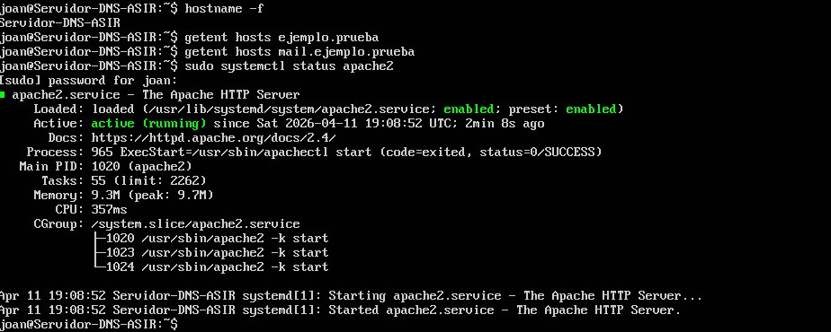

*Comprobaciones iniciales. El DNS no resolvía mail.ejemplo.prueba y Apache estaba activo.*

Dado que el DNS no resolvía `mail.ejemplo.prueba`, se añadieron las entradas en `/etc/hosts`:

```bash
172.16.0.1  mail.ejemplo.prueba mail
172.16.0.1  ejemplo.prueba
```

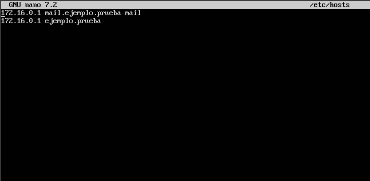

*Archivo /etc/hosts con las entradas añadidas.*

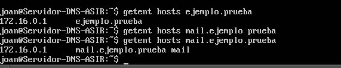

*Ambos nombres resuelven correctamente a 172.16.0.1.*

---

## 2. Actualización del sistema e instalación de utilidades

```bash
sudo apt update && sudo apt upgrade -y
sudo apt install -y mailutils unzip
```

---

## 3. Instalación y configuración de Postfix (SMTP)

Postfix ya estaba instalado de una práctica anterior, por lo que se procedió directamente a su configuración.

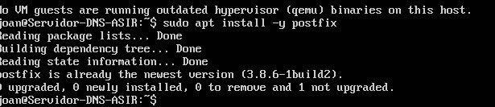

*Postfix ya se encontraba instalado en el sistema (versión 3.8.6).*

### 3.1 /etc/postfix/main.cf

```bash
myhostname = mail.ejemplo.prueba
mydomain   = ejemplo.prueba
myorigin   = $mydomain
mydestination = $myhostname, localhost.$mydomain, localhost, $mydomain
inet_interfaces = all
```

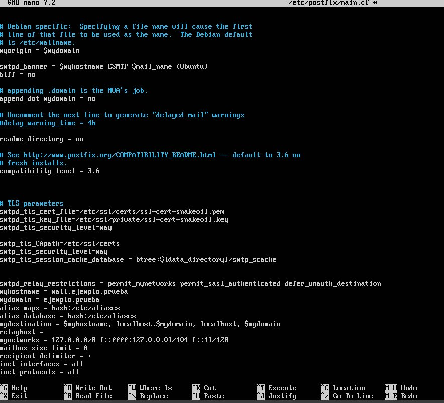

*/etc/postfix/main.cf con los parámetros configurados.*

### 3.2 /etc/postfix/master.cf — puerto 587

```bash
submission inet n       -       y       -       -       smtpd
  -o smtpd_tls_security_level=encrypt
```

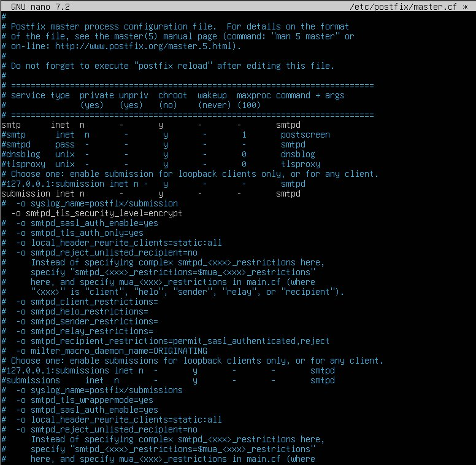

*master.cf con el bloque submission descomentado y TLS obligatorio.*

### 3.3 Reinicio y comprobación

```bash
sudo systemctl restart postfix
sudo systemctl enable postfix
sudo postfix status
```

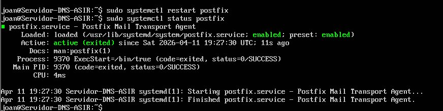

*Estado de Postfix tras el reinicio.*

---

## 4. Instalación y configuración de Dovecot (IMAP)

```bash
sudo apt install -y dovecot-core dovecot-imapd
```

### 4.1 Formato de buzón

```bash
# /etc/dovecot/conf.d/10-mail.conf
mail_location = maildir:~/Maildir
```

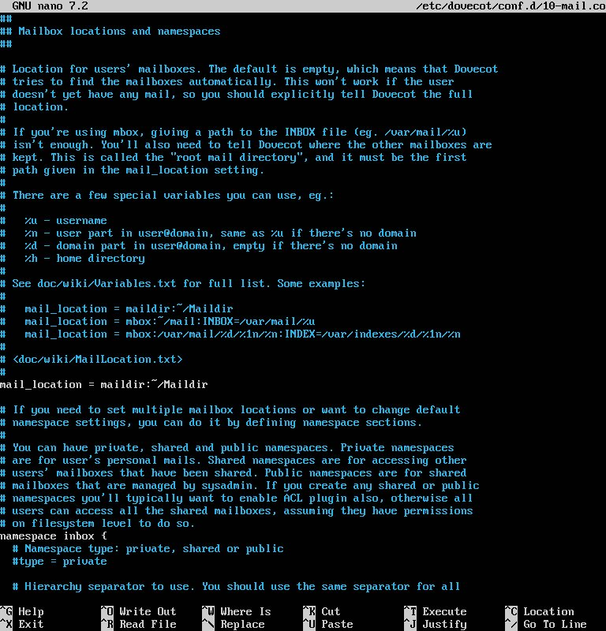

*10-mail.conf con mail_location activo.*

### 4.2 Reinicio y comprobación

```bash
sudo systemctl restart dovecot
sudo systemctl enable dovecot
sudo systemctl status dovecot --no-pager
```

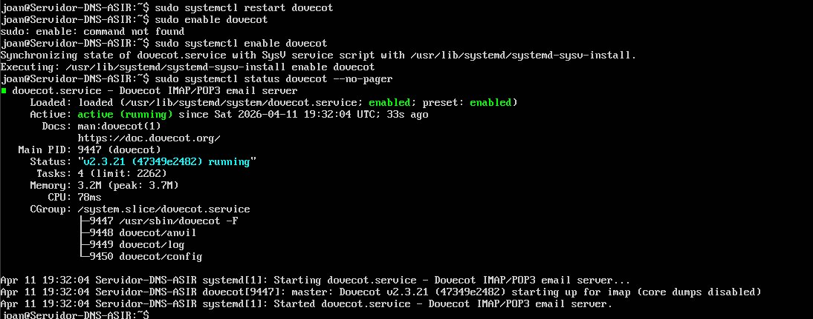

*Dovecot activo con estado active (running).*

---

## 5. Creación de cuentas de correo

```bash
sudo adduser juan
sudo adduser maria
```

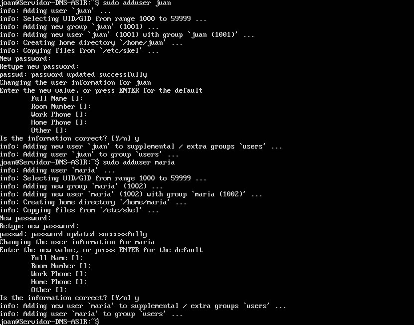

*Creación de los usuarios juan (UID 1001) y maria (UID 1002).*

---

## 6. Configuración de TLS/SSL

Se reutilizaron los certificados ya instalados para Apache, localizados en `/etc/ssl/private/ejemplo.prueba`.

### 6.1 TLS en Postfix

```bash
smtpd_tls_cert_file=/etc/ssl/private/ejemplo.prueba
smtpd_tls_key_file=/etc/ssl/private/ejemplo.prueba
smtpd_tls_security_level=may
smtp_tls_security_level=may
smtpd_tls_auth_only=yes
```

### 6.2 TLS en Dovecot

```bash
# /etc/dovecot/conf.d/10-ssl.conf
ssl = yes
ssl_cert = </etc/ssl/private/ejemplo.prueba
ssl_key  = </etc/ssl/private/ejemplo.prueba
```

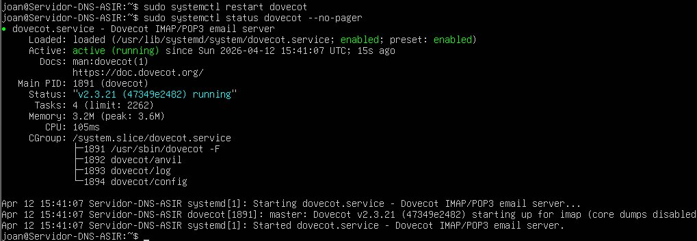

*Dovecot activo tras aplicar la configuración TLS.*

---

## 7. Configuración del firewall (UFW)

```bash
sudo ufw enable
sudo ufw allow 22/tcp    # SSH
sudo ufw allow 25/tcp    # SMTP
sudo ufw allow 80/tcp    # HTTP
sudo ufw allow 443/tcp   # HTTPS
sudo ufw allow 587/tcp   # SMTP Submission
sudo ufw allow 993/tcp   # IMAPS
sudo ufw status verbose
```

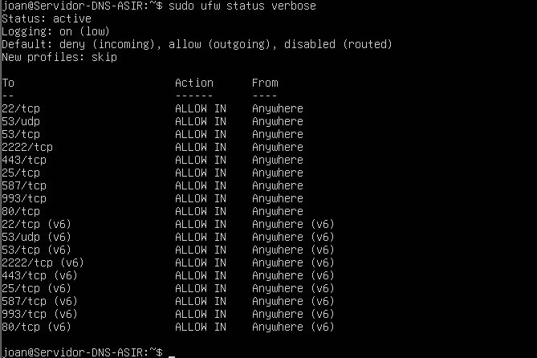

*Estado del firewall UFW con los puertos de correo permitidos.*

---

## 8. Verificación de puertos activos

```bash
sudo ss -lntp | egrep ':(25|587|993)'
```

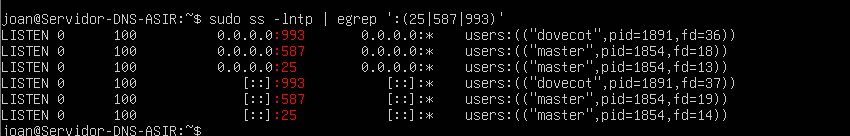

*Puertos 993 (Dovecot), 587 y 25 (Postfix) en estado LISTEN.*

---

## 9. Verificación del handshake TLS

```bash
openssl s_client -connect localhost:993
```

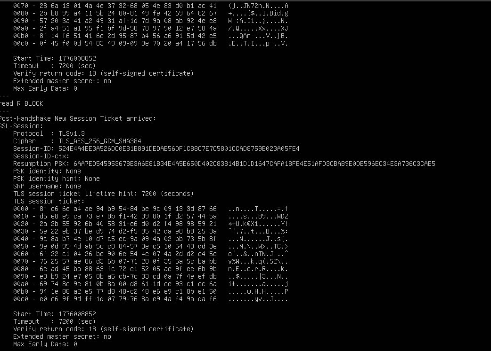

*Handshake TLS con Verify return code: 18.*

---

## 10. Prueba de envío y recepción

```bash
echo "Hola Maria, esto es una prueba de correo" | mail -s "Prueba de correo" maria@ejemplo.prueba
su - maria
mail
```

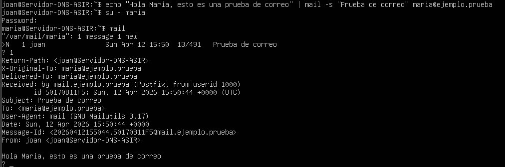

*Correo recibido en el buzón de maria, procesado por Postfix en mail.ejemplo.prueba.*
