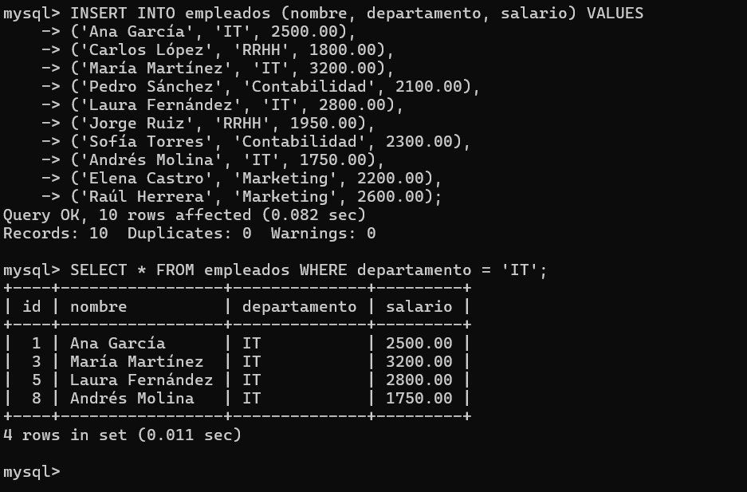
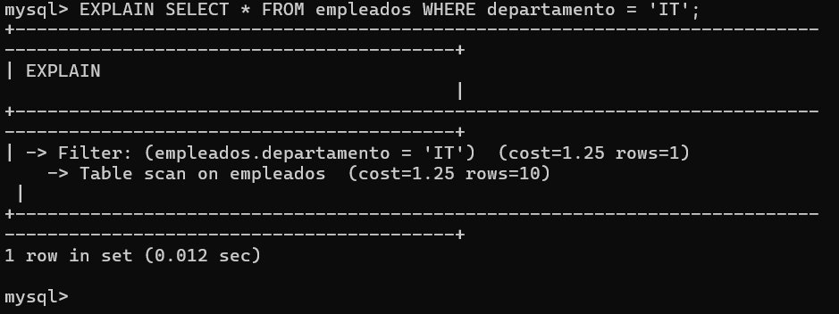
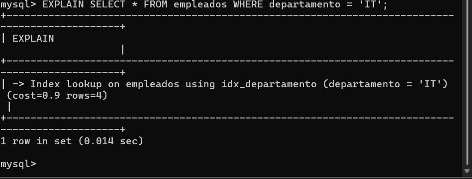
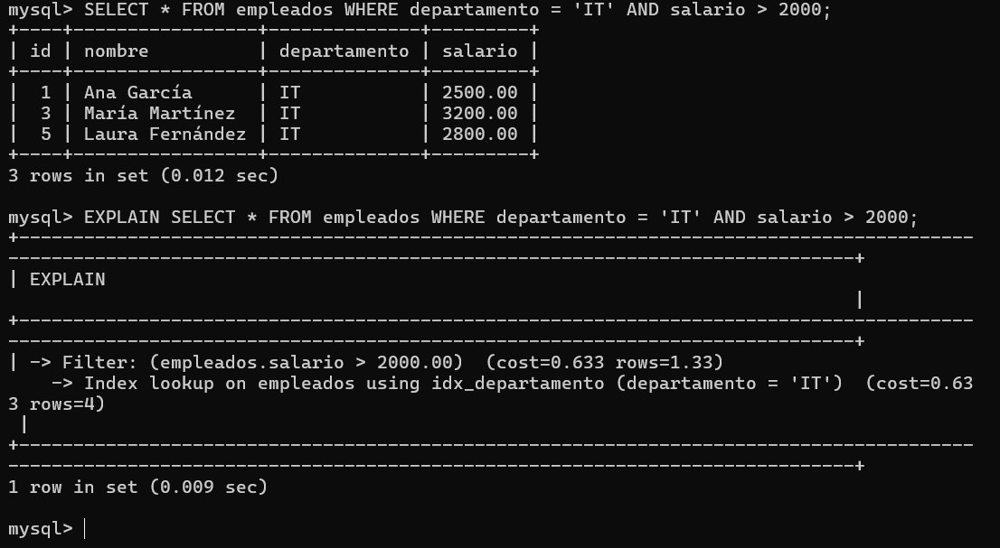

# Tarea 7 — Creación y análisis de índices en MySQL

**Jhoan Camilo Arango Ortiz** · 2º ASIR online

---

## Objetivo

El objetivo de esta tarea es comprender el impacto que tienen los índices en el rendimiento de las consultas en MySQL. Para ello se ha creado una base de datos con una tabla de empleados, se han ejecutado consultas con y sin índices y se han analizado los resultados usando la herramienta `EXPLAIN`.

---

## 1. Creación del entorno de trabajo

Se creó la base de datos `empresa_indices` y dentro de ella la tabla `empleados` con los campos id (clave primaria), nombre, departamento y salario. Se insertaron 10 registros con datos variados repartidos entre los departamentos IT, RRHH, Contabilidad y Marketing.

```sql
CREATE DATABASE empresa_indices;
USE empresa_indices;

CREATE TABLE empleados (
    id INT AUTO_INCREMENT PRIMARY KEY,
    nombre VARCHAR(100),
    departamento VARCHAR(50),
    salario DECIMAL(8,2)
);

INSERT INTO empleados (nombre, departamento, salario) VALUES
('Ana Garcia', 'IT', 2500.00),
('Carlos Lopez', 'RRHH', 1800.00),
('Maria Martinez', 'IT', 3200.00),
('Pedro Sanchez', 'Contabilidad', 2100.00),
('Laura Fernandez', 'IT', 2800.00),
('Jorge Ruiz', 'RRHH', 1950.00),
('Sofia Torres', 'Contabilidad', 2300.00),
('Andres Molina', 'IT', 1750.00),
('Elena Castro', 'Marketing', 2200.00),
('Raul Herrera', 'Marketing', 2600.00);
```

---

## 2. Análisis sin índices

Se ejecutó una consulta de filtrado por departamento antes de crear ningún índice. La consulta devolvió los 4 empleados del departamento IT.

```sql
SELECT * FROM empleados WHERE departamento = 'IT';
```



*Resultado de la consulta sin índice: 4 empleados del departamento IT.*

A continuación se analizó la consulta con `EXPLAIN`. El resultado mostró un **Table scan** sobre la tabla completa: MySQL recorrió las 10 filas una a una sin ninguna pista de dónde estaban los datos. No se utilizó ningún índice. El coste estimado fue de 1.25 con 10 filas analizadas.

```sql
EXPLAIN SELECT * FROM empleados WHERE departamento = 'IT';
```



*EXPLAIN sin índice: Table scan sobre las 10 filas de la tabla.*

---

## 3. Creación de índice sobre departamento

Se creó un índice simple sobre la columna `departamento`. Este índice permite a MySQL localizar directamente las filas que coinciden con un valor concreto sin recorrer la tabla completa.

```sql
CREATE INDEX idx_departamento ON empleados(departamento);
```

---

## 4. Análisis con índice

Tras crear el índice se volvió a ejecutar el mismo `EXPLAIN`. El resultado cambió: en lugar de un Table scan, MySQL realizó un **Index lookup** usando `idx_departamento`. El número de filas estimadas bajó de 10 a 4 y el coste se redujo de 1.25 a 0.9. MySQL ya no recorre toda la tabla sino que va directamente a las entradas del índice que corresponden al departamento IT.



*EXPLAIN con índice: Index lookup con coste 0.9 sobre 4 filas.*

---

## 5. Índice compuesto (departamento + salario)

Se creó un índice compuesto sobre las columnas `departamento` y `salario`, útil para consultas que filtran habitualmente por ambas columnas a la vez.

```sql
CREATE INDEX idx_dep_sal ON empleados(departamento, salario);
```

Se ejecutó la consulta con doble filtro y se analizó con `EXPLAIN`. MySQL usó `idx_departamento` para el filtro de departamento y aplicó el filtro de salario como paso adicional. Con una tabla de solo 10 registros el optimizador considera suficiente el índice simple, pero el coste bajó hasta 0.633 y las filas estimadas a 1.33, lo que demuestra que el índice compuesto aporta información adicional al planificador. En tablas de gran volumen el índice compuesto sería seleccionado directamente.

```sql
SELECT * FROM empleados
WHERE departamento = 'IT' AND salario > 2000;
```



*EXPLAIN con índice compuesto: coste 0.633, filtro aplicado sobre 4 filas del índice.*

---

## 6. Reflexión final

**¿Para qué sirven los índices?**

Los índices sirven para que MySQL localice los datos sin tener que escanear toda la tabla. Funcionan de forma similar al índice de un libro: en lugar de leer todas las páginas para encontrar un término, el índice apunta directamente a la posición correcta.

**¿En qué casos mejoran el rendimiento?**

Los índices son especialmente útiles en tablas con un volumen alto de registros y en columnas que se usan frecuentemente en cláusulas WHERE, JOIN u ORDER BY. A pequeña escala la mejora es marginal, pero en tablas con miles o millones de filas la diferencia en tiempo de respuesta es muy significativa.

**¿En qué casos pueden perjudicarlo?**

Los índices ocupan espacio en disco adicional y tienen un coste de mantenimiento: cada vez que se inserta, modifica o elimina un registro, MySQL tiene que actualizar también todos los índices de esa tabla. En tablas con operaciones de escritura muy frecuentes, tener demasiados índices puede ralentizar esas operaciones más de lo que mejoran las consultas de lectura.
