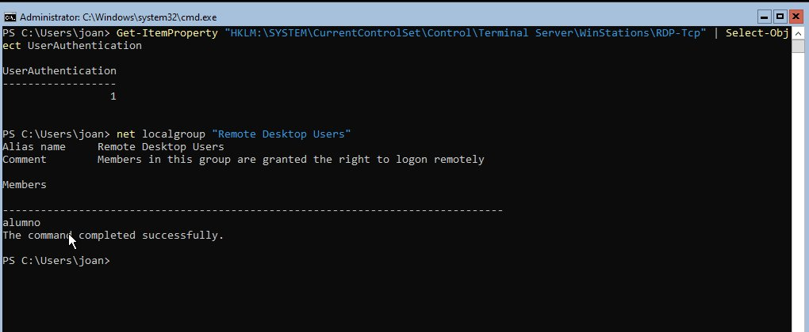
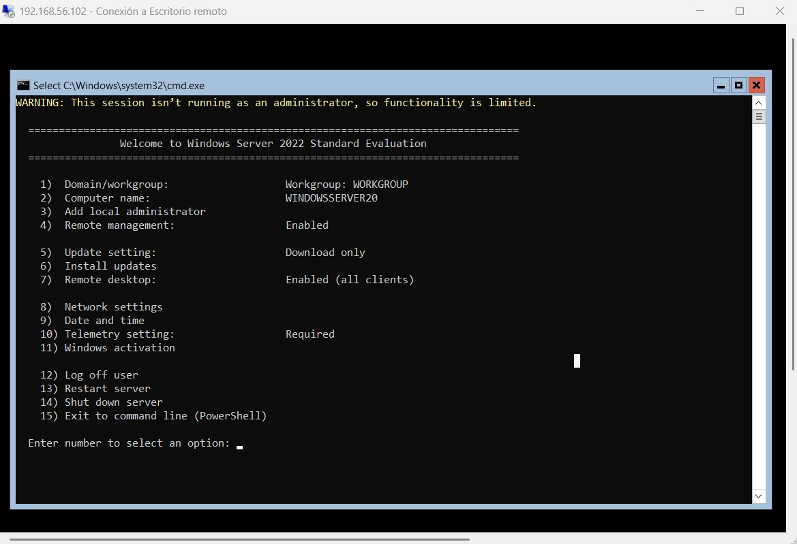
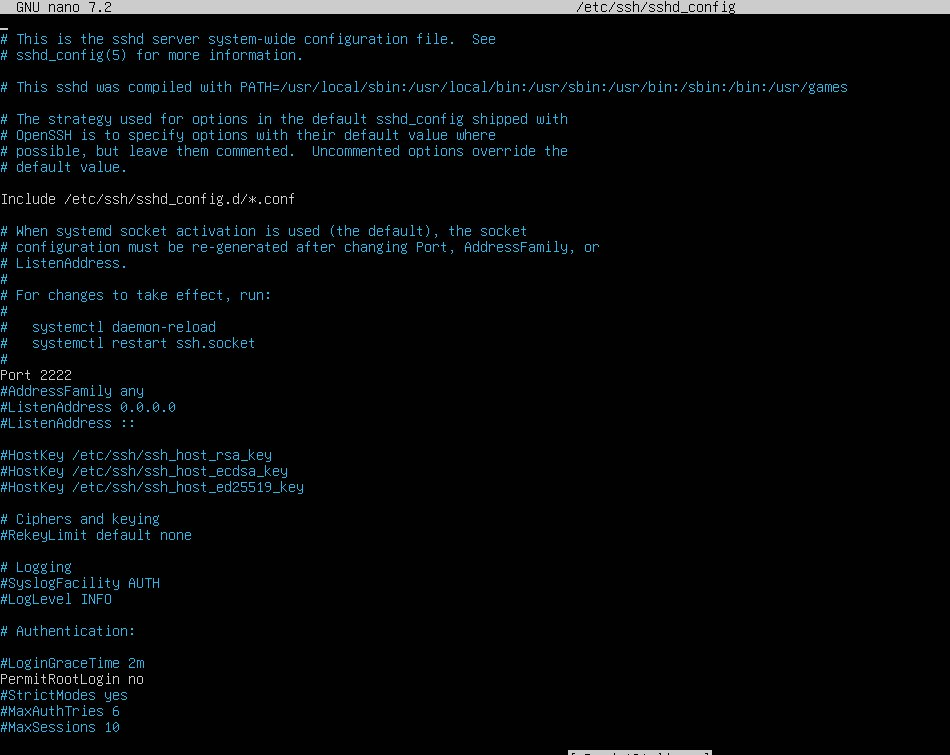
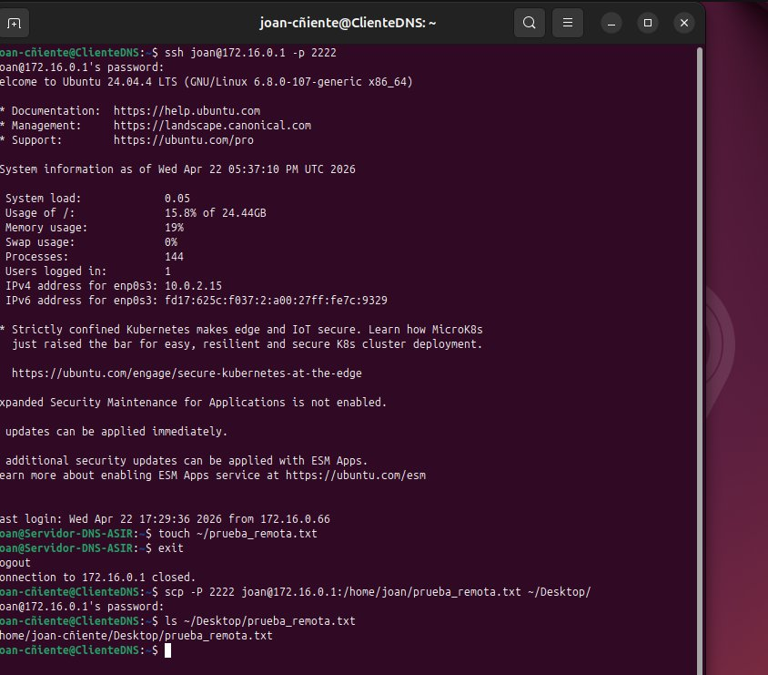

# Tarea 7 — Configuración de la administración remota del sistema operativo

**Jhoan Camilo Arango Ortiz** · 2º ASIR online  
Módulo: Administración de Sistemas Operativos (0374)

---

## Objetivo

El objetivo de esta tarea es implementar y securizar los dos protocolos de administración remota más utilizados en entornos profesionales: RDP para Windows Server y SSH para Ubuntu Server.

---

## 1. Administración Windows — Escritorio Remoto (RDP)

Se configuró Windows Server 2022 para aceptar conexiones RDP con Autenticación a Nivel de Red (NLA). Se creó el usuario local `alumno` y se añadió al grupo *Remote Desktop Users*. La NLA se activó mediante el registro del sistema al no disponer de interfaz gráfica en la instalación Core.

```powershell
# Crear usuario local
net user alumno Password123 /add

# Añadir al grupo de Escritorio Remoto
net localgroup "Remote Desktop Users" alumno /add

# Activar NLA por registro
Set-ItemProperty -Path "HKLM:\SYSTEM\CurrentControlSet\Control\Terminal Server\WinStations\RDP-Tcp" `
    -Name "UserAuthentication" -Value 1
```



*NLA activada (UserAuthentication=1) y usuario alumno en el grupo Remote Desktop Users.*

La conexión se realizó desde el equipo anfitrión usando `mstsc` con el usuario `WINDOWSSERVER20\alumno`. El adaptador de red se configuró en modo Host-only para garantizar la conectividad entre el anfitrión y la VM.



*Sesión RDP activa sobre Windows Server 2022 mostrando la herramienta SConfig.*

### ¿Por qué es importante activar NLA en un entorno empresarial?

La Autenticación a Nivel de Red exige que el usuario se identifique antes de que el servidor llegue a cargar el escritorio remoto, lo que impide ataques de denegación de servicio contra la sesión gráfica y bloquea el acceso a versiones antiguas de RDP que no implementan cifrado adecuado. Sin NLA, cualquier cliente podría iniciar la negociación gráfica y explotar vulnerabilidades en la capa de presentación antes de autenticarse, exponiendo el servidor a ataques como BlueKeep.

---

## 2. Administración Linux — Secure Shell (SSH)

El servidor OpenSSH estaba instalado de una práctica anterior y se encontraba activo. Se aplicaron dos medidas de hardening en `/etc/ssh/sshd_config`: cambiar el puerto de escucha al 2222 y deshabilitar el acceso directo como root.

```bash
# Directivas modificadas en /etc/ssh/sshd_config
Port 2222
PermitRootLogin no

# Reiniciar el servicio
sudo systemctl restart ssh
```



*Archivo sshd_config mostrando Port 2222 y PermitRootLogin no.*

### Conexión SSH y transferencia segura con SCP

Desde Ubuntu Desktop (172.16.0.66) se estableció una sesión SSH contra el servidor (172.16.0.1) especificando el puerto 2222. Dentro se creó el archivo `prueba_remota.txt` y, tras cerrar la sesión, se descargó al cliente mediante SCP.

```bash
# Conexión SSH desde el cliente
ssh joan@172.16.0.1 -p 2222

# Crear archivo en el servidor
touch ~/prueba_remota.txt
exit

# Descargar el archivo con SCP
scp -P 2222 joan@172.16.0.1:/home/joan/prueba_remota.txt ~/Desktop/
```



*Transferencia SCP exitosa: el archivo prueba_remota.txt se descarga cifrado al escritorio del cliente.*

### Riesgo de dejar PermitRootLogin yes en un servidor expuesto a Internet

Dejar habilitado el acceso root por SSH significa que cualquier atacante puede intentar autenticarse directamente como superusuario mediante fuerza bruta. Si tiene éxito obtiene control total del sistema sin necesidad de escalar privilegios. Los ataques de diccionario automatizados prueban miles de contraseñas por minuto, por lo que un servidor expuesto a Internet con esta configuración es un objetivo fácil incluso con contraseñas moderadamente seguras.

---

## 3. Conclusión profesional

La diferencia más evidente entre SSH y RDP es el ancho de banda que consume cada protocolo. Una sesión SSH transmite únicamente texto: comandos y sus respuestas, lo que supone apenas unos pocos kilobytes por segundo incluso en operaciones intensivas. RDP, en cambio, tiene que comprimir y transmitir continuamente la imagen del escritorio gráfico, lo que en condiciones normales consume varios megabits por segundo y aumenta considerablemente la latencia percibida.

Desde el punto de vista de la agilidad, administrar un servidor Linux por SSH es más rápido: los comandos se ejecutan de forma inmediata y es posible automatizar tareas con scripts sin depender de una interfaz visual. En redes con ancho de banda limitado o alta latencia, SSH sigue siendo perfectamente usable mientras que una sesión RDP puede volverse impracticable. Por otro lado, RDP resulta más intuitivo para administradores habituados a entornos Windows y facilita tareas que requieren interacción visual. En un entorno profesional, lo habitual es combinar ambos protocolos según el sistema operativo y el tipo de tarea.
