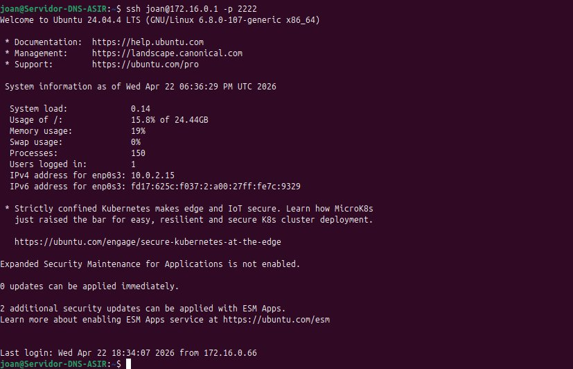
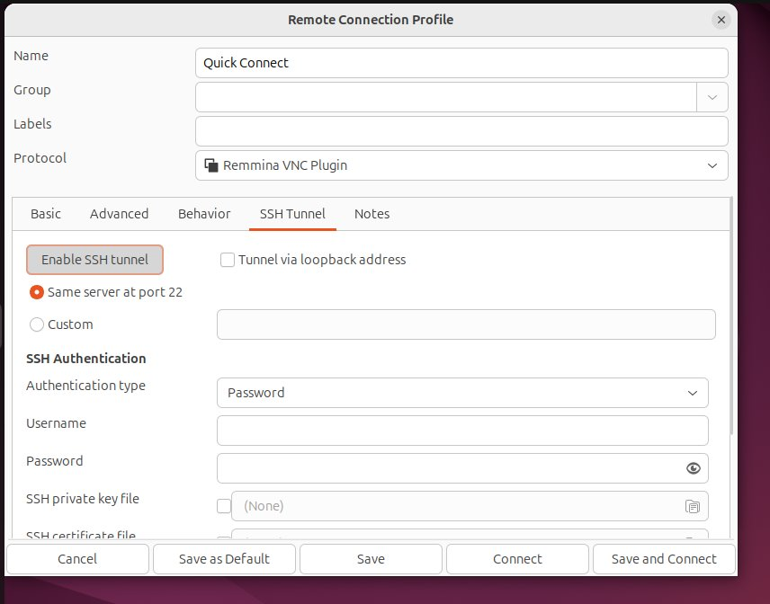
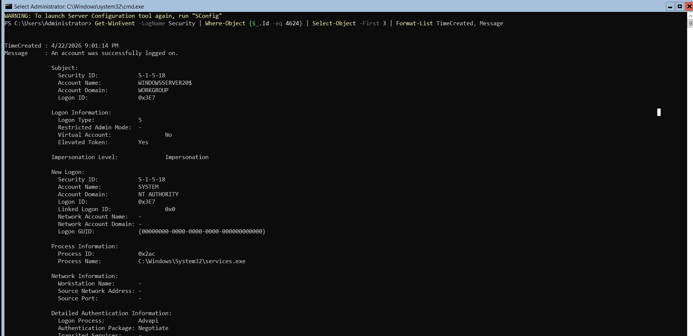
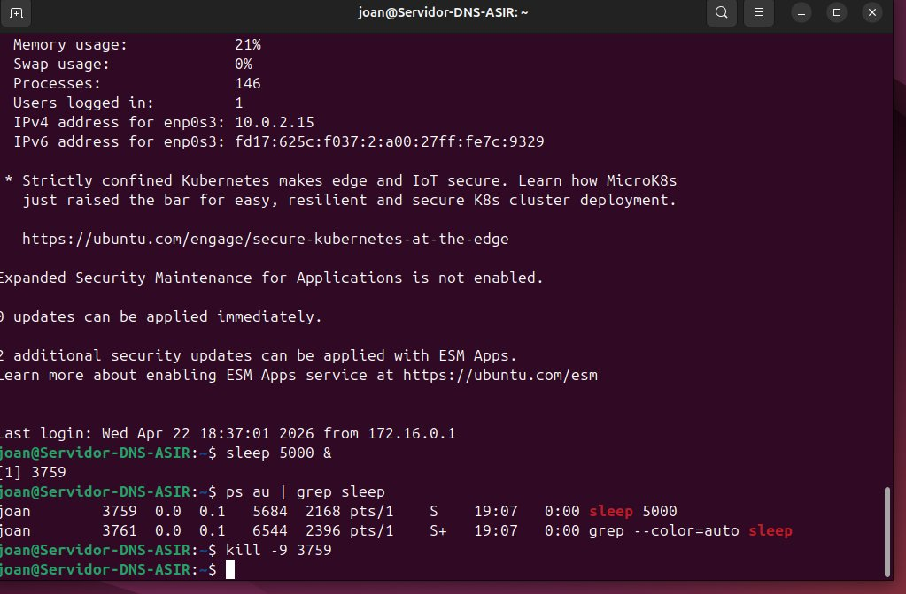

# Tarea 8 — Administración Remota Avanzada y Seguridad

**Jhoan Camilo Arango Ortiz** · 2º ASIR online  
Módulo: Administración de Sistemas Operativos (0374)

---

## Objetivo

El objetivo de esta tarea es implementar mecanismos de autenticación mediante claves criptográficas, encapsular conexiones gráficas dentro de túneles SSH cifrados y realizar una auditoría básica de los registros del sistema para identificar accesos a los servidores.

---

## 1. Seguridad a nivel de protocolo — Claves y túneles

### Autenticación SSH por claves asimétricas

La autenticación por contraseña es vulnerable a ataques de fuerza bruta e interceptación. Se configuró la autenticación SSH mediante par de claves RSA: desde Ubuntu Desktop se generó el par de claves y se copió la clave pública al servidor. A partir de ese momento el servidor solo acepta conexiones del cliente que posea la clave privada correspondiente.

```bash
# Generar par de claves RSA en el cliente
ssh-keygen -t rsa -f ~/.ssh/id_rsa

# Copiar clave pública al servidor
ssh-copy-id -p 2222 joan@172.16.0.1

# Conectar sin contraseña
ssh joan@172.16.0.1 -p 2222
```



*Conexión SSH al servidor sin solicitud de contraseña gracias a la autenticación por clave RSA.*

### Túnel SSH para conexiones VNC con Remmina

El protocolo VNC transmite la sesión gráfica sin cifrar. Usando Remmina se configuró un túnel SSH que encapsula la conexión VNC dentro de un canal SSH cifrado. En la pestaña *SSH Tunnel* se activó *Enable SSH tunnel* con el mismo servidor en el puerto 2222.



*Remmina con el túnel SSH activado sobre una conexión VNC al servidor.*

### ¿Por qué encapsular VNC en un túnel SSH es una medida crítica?

VNC transmite toda la sesión gráfica en texto plano: cualquier atacante con acceso a la red puede capturar la pantalla, las pulsaciones de teclado y las credenciales con un simple sniffer. Al encapsular la conexión dentro de un túnel SSH, todo el tráfico queda cifrado con los mismos algoritmos que protegen SSH. En Internet público, donde el tráfico atraviesa redes no controladas, esta medida es imprescindible para cualquier administración remota de servidores.

---

## 2. Auditoría y resolución de incidencias

### Auditoría de accesos en Windows Server

Se consultaron los eventos de seguridad con ID 4624 (inicio de sesión correcto) mediante PowerShell. El evento muestra la hora exacta, el tipo de inicio de sesión y el proceso que lo originó.

```powershell
Get-WinEvent -LogName Security |
  Where-Object {$_.Id -eq 4624} |
  Select-Object -First 3 |
  Format-List TimeCreated, Message
```



*Evento 4624 en el log de Seguridad de Windows Server: inicio de sesión correcto con fecha y detalles.*

### Resolución de incidencias en Linux

Se simuló un proceso colgado lanzando `sleep 5000` en segundo plano. Con `ps au` se localizó el PID y se eliminó forzosamente con `kill -9`, que envía la señal SIGKILL sin posibilidad de que el proceso la ignore.

```bash
# Lanzar proceso en segundo plano
sleep 5000 &

# Localizar el PID
ps au | grep sleep

# Matar el proceso forzosamente
kill -9 3759
```



*Localización del PID 3759 con ps au y eliminación forzosa del proceso con kill -9.*

### ¿Qué archivo de log consultarías para auditar intentos fallidos de SSH?

En Ubuntu Server el archivo a consultar es `/var/log/auth.log`, que registra todos los eventos de autenticación del sistema, incluidos los intentos fallidos de SSH. Cada intento fallido genera una línea con la IP de origen, el usuario utilizado y la hora exacta, lo que permite detectar ataques de fuerza bruta. En distribuciones basadas en Red Hat el archivo equivalente es `/var/log/secure`.

---

## 3. Conclusión profesional

Permitir que todos los empleados de una organización tengan acceso RDP a los servidores de producción supone un riesgo grave. Cuanto mayor es el número de usuarios con acceso remoto, mayor es la superficie de ataque: más cuentas susceptibles de ser comprometidas por fuerza bruta, phishing o reutilización de contraseñas. Un empleado sin perfil técnico no necesita acceso directo al servidor y su cuenta puede convertirse en un vector de entrada para un atacante.

Revisar periódicamente el Visor de Eventos de Seguridad es esencial porque permite detectar patrones anómalos: múltiples intentos fallidos desde una misma IP, accesos fuera del horario laboral o inicios de sesión con cuentas inactivas son señales de alerta que solo se identifican auditando los logs. Sin esta revisión, un ataque puede pasar desapercibido durante semanas. La política correcta en un entorno corporativo es limitar el acceso RDP exclusivamente al grupo de administradores, usar autenticación por certificado o MFA, y revisar los logs de seguridad de forma automatizada con herramientas SIEM.
