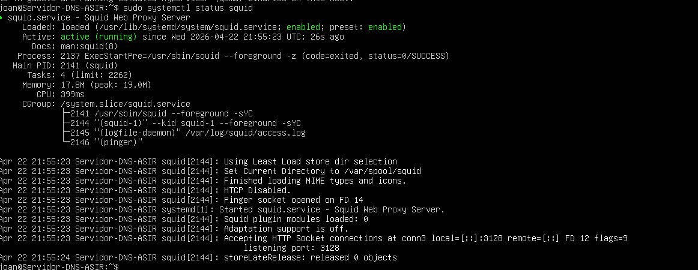
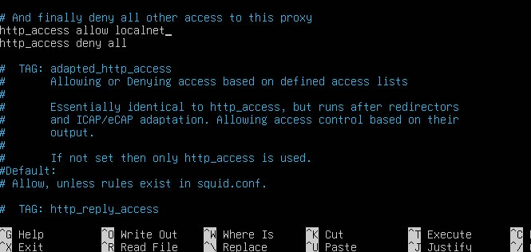
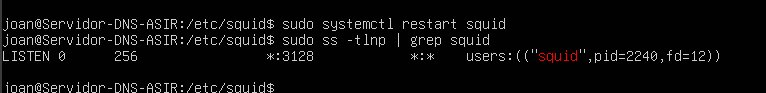
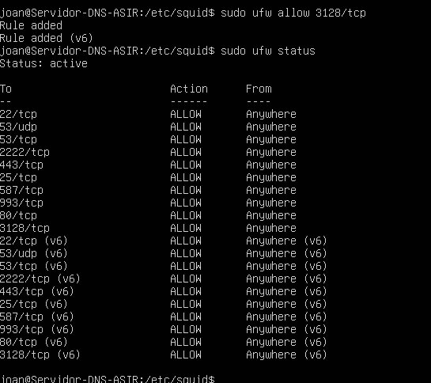
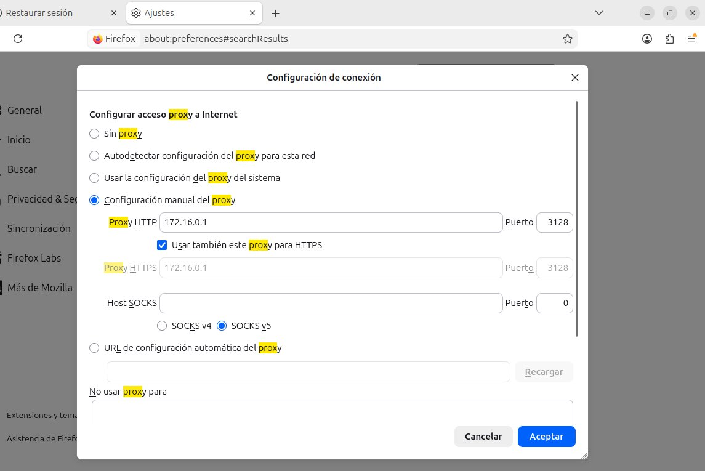
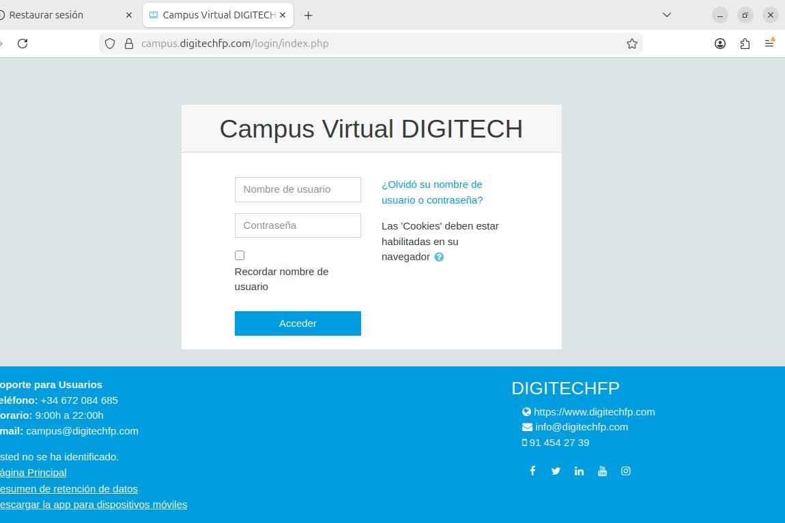
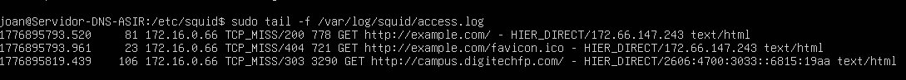

# Lab 07 — Instalación y configuración básica de Squid

**Jhoan Camilo Arango Ortiz** · 2º ASIR online

---

## Objetivo

Instalación y configuración de un servidor proxy-cache Squid sobre Ubuntu Server. El servidor actúa como intermediario entre los clientes de la red interna 172.16.0.0/24 e Internet, gestionando, controlando y registrando todo el tráfico web que pasa a través de él.

---

## Escenario

El servidor dispone de dos interfaces de red: la primera (enp0s3) en modo NAT para el acceso a Internet, y la segunda (enp0s8) conectada a la red interna 172.16.0.0/24. El cliente tiene la IP 172.16.0.66 y usa el servidor como gateway y proxy.

---

## 1. Instalación de Squid

Se actualizan los repositorios y se instala Squid. La instalación crea automáticamente el servicio systemd y descarga las dependencias necesarias.

```bash
sudo apt update
sudo apt install squid
```

Una vez instalado, se verifica que el servicio está activo:

```bash
sudo systemctl status squid
```



*Squid activo y en ejecución tras la instalación, escuchando en el puerto 3128.*

---

## 2. Copia de seguridad del archivo de configuración

Antes de modificar squid.conf se realiza una copia de seguridad para poder restaurar el estado original si fuera necesario.

```bash
cd /etc/squid
sudo cp squid.conf squid.conf.bak
```

---

## 3. Configuración básica del acceso

El archivo squid.conf bloquea todo el tráfico por defecto. Para permitir el acceso desde la red interna se añade `http_access allow localnet` justo antes de la regla `http_access deny all`.

```bash
sudo nano /etc/squid/squid.conf
```



*Reglas http_access en squid.conf: allow localnet antes del deny all.*

---

## 4. Reinicio del servicio y verificación del puerto

Tras guardar los cambios se reinicia el servicio y se comprueba que Squid sigue escuchando en el puerto 3128.

```bash
sudo systemctl restart squid
sudo ss -tlnp | grep squid
```



*Squid escuchando en el puerto 3128 tras el reinicio.*

---

## 5. Apertura del puerto en el cortafuegos

UFW estaba activo pero sin regla para el puerto 3128. Se añade la regla para que los clientes puedan conectar con el proxy.

```bash
sudo ufw allow 3128/tcp
sudo ufw status
```



*Puerto 3128/tcp abierto en UFW para IPv4 e IPv6.*

---

## 6. Configuración del cliente

En el equipo cliente (172.16.0.66) se configura Firefox para usar el proxy. En Ajustes > Configuración de red se selecciona configuración manual indicando la IP del servidor (172.16.0.1) y el puerto 3128 tanto para HTTP como para HTTPS.



*Configuración manual del proxy en Firefox apuntando a 172.16.0.1:3128.*

---

## 7. Prueba de funcionamiento

Se verifica que el cliente puede navegar a través del proxy accediendo a una web externa. La página carga correctamente, confirmando que el proxy está funcionando como intermediario.



*Navegación correcta a través del proxy desde el cliente.*

---

## 8. Análisis de los registros

Squid registra todas las peticiones en `/var/log/squid/access.log`. Monitorizando el log se pueden ver las peticiones del cliente, la IP de origen, el método HTTP y el dominio solicitado.

```bash
sudo tail -f /var/log/squid/access.log
```



*Registro de acceso mostrando peticiones del cliente 172.16.0.66 a través del proxy.*
