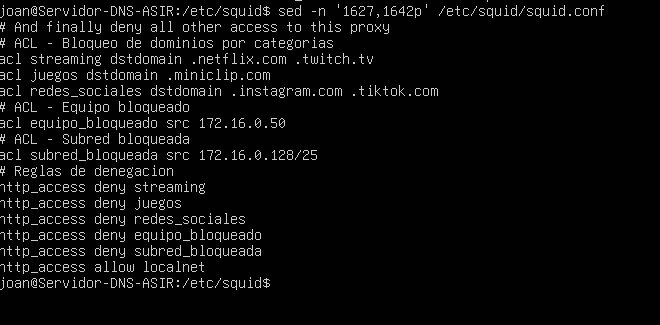
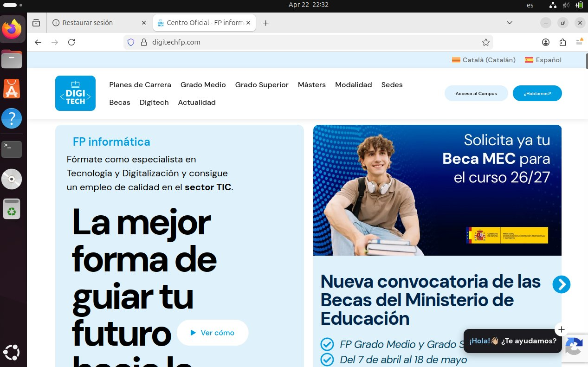
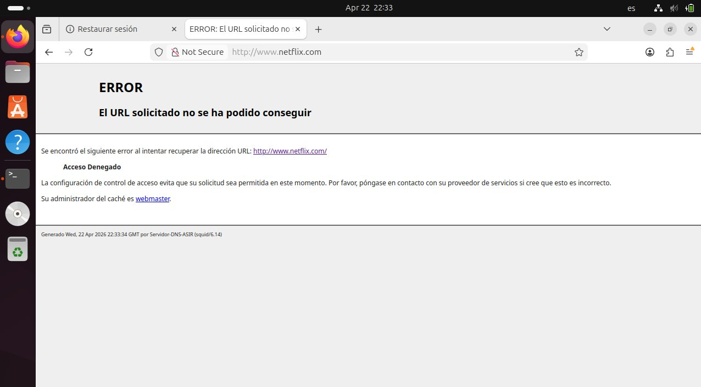
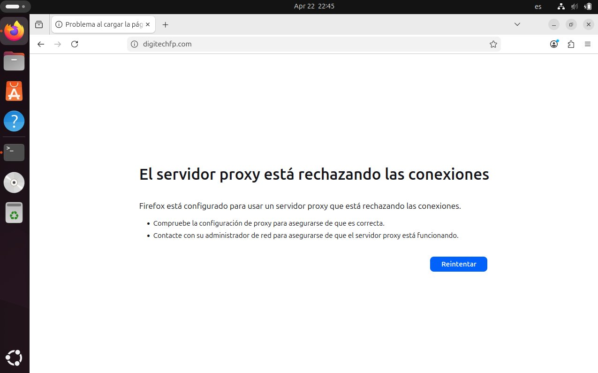
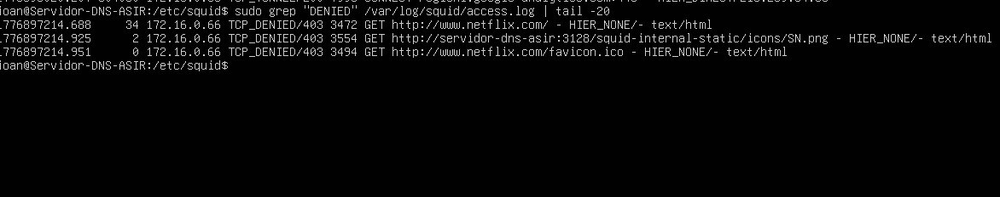

# Lab 08 — Diseño y aplicación de políticas de acceso en Squid

**Jhoan Camilo Arango Ortiz** · 2º ASIR online

---

## Objetivo

Diseño e implementación de políticas de control de acceso mediante reglas ACL en el servidor proxy Squid. Se simula un entorno corporativo donde se restringen categorías de sitios web, se bloquea un equipo concreto y se deniega el acceso a toda una subred, permitiendo la navegación al resto de usuarios.

---

## Escenario

Red interna: 172.16.0.0/24. Servidor proxy en 172.16.0.1, configurado en la Tarea 9. Se parte de esa base para añadir las reglas de control de acceso requeridas por la empresa.

---

## Parte 1. Diseño teórico de las ACL

Squid evalúa las reglas ACL en orden secuencial y aplica la primera que coincide, por lo que las denegaciones específicas deben preceder a la regla general de permiso.

**ACL por dominio (dstdomain):** identifica el dominio de destino de la petición. Se usan para bloquear categorías de sitios: streaming (.netflix.com, .twitch.tv), juegos (.miniclip.com) y redes sociales (.instagram.com, .tiktok.com).

**ACL por IP de origen (src):** bloquea equipos o subredes concretas independientemente del destino. Se aplican al equipo 172.16.0.50 y a la subred 172.16.0.128/25.

**Orden de las reglas:** primero se deniegan los dominios bloqueados, luego el equipo y la subred, después se permite el acceso al resto de la red local con `http_access allow localnet`, y finalmente `http_access deny all` cierra cualquier tráfico no contemplado.

---

## Parte 2. Implementación de las reglas

Se edita `/etc/squid/squid.conf` añadiendo el bloque de ACL justo antes de `http_access allow localnet`:

```
# ACL - Bloqueo de dominios por categorias
acl streaming dstdomain .netflix.com .twitch.tv
acl juegos dstdomain .miniclip.com
acl redes_sociales dstdomain .instagram.com .tiktok.com

# ACL - Equipo bloqueado
acl equipo_bloqueado src 172.16.0.50

# ACL - Subred bloqueada
acl subred_bloqueada src 172.16.0.128/25

# Reglas de denegacion
http_access deny streaming
http_access deny juegos
http_access deny redes_sociales
http_access deny equipo_bloqueado
http_access deny subred_bloqueada
```



*Bloque de ACL y reglas http_access añadido en squid.conf.*

Se valida la sintaxis y se reinicia el servicio:

```bash
sudo squid -k parse
sudo systemctl restart squid
```

---

## Parte 3. Comprobaciones

### Acceso permitido

Un equipo de la red interna no afectado por ninguna restricción puede navegar con normalidad.



*Navegación permitida a digitechfp.com desde el cliente.*

---

### Bloqueo de dominio de streaming

Al intentar acceder a netflix.com el proxy devuelve acceso denegado, confirmando que la ACL de streaming funciona.



*Acceso denegado a netflix.com por la regla ACL de streaming.*

---

### Bloqueo de equipo concreto

Se cambia temporalmente la IP del cliente a 172.16.0.50 con nmcli. Con esa IP cualquier intento de navegación es rechazado por el proxy.

```bash
sudo nmcli con mod "netplan-enp0s3" ipv4.addresses 172.16.0.50/24 ipv4.method manual
sudo nmcli con up "netplan-enp0s3"
```



*El proxy rechaza todas las conexiones del equipo con IP 172.16.0.50.*

---

### Verificación en los registros

Filtrando por TCP_DENIED en el log de acceso se confirma que las reglas ACL están actuando y que el servidor registra los intentos bloqueados.

```bash
sudo grep "DENIED" /var/log/squid/access.log | tail -20
```



*Entradas TCP_DENIED en access.log para netflix.com desde el cliente.*
