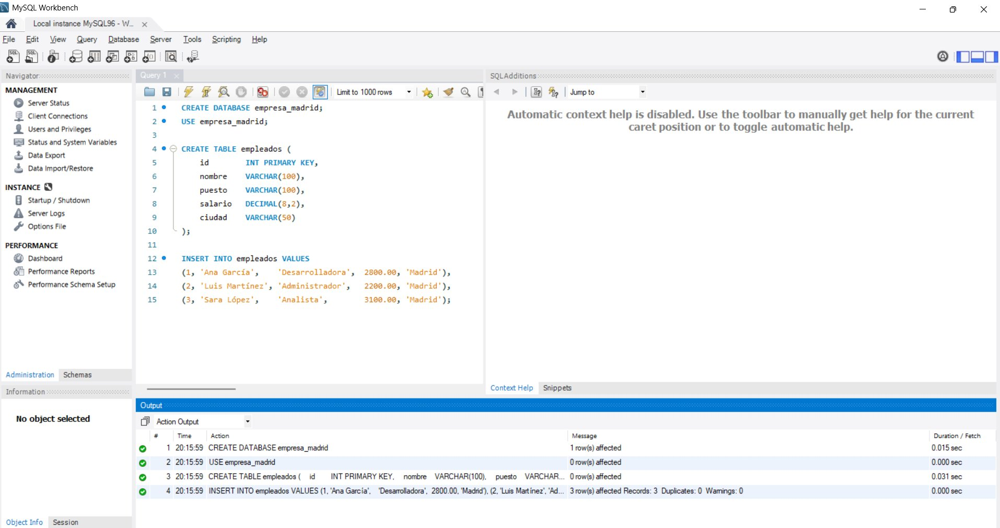
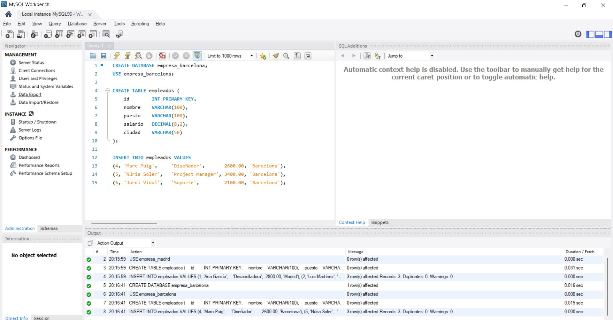
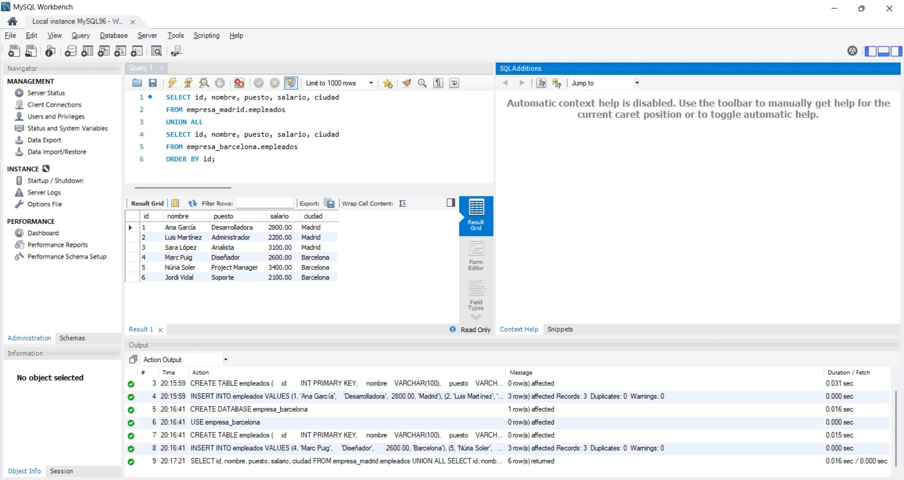
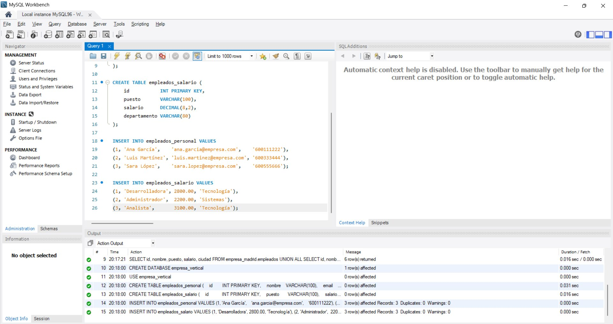
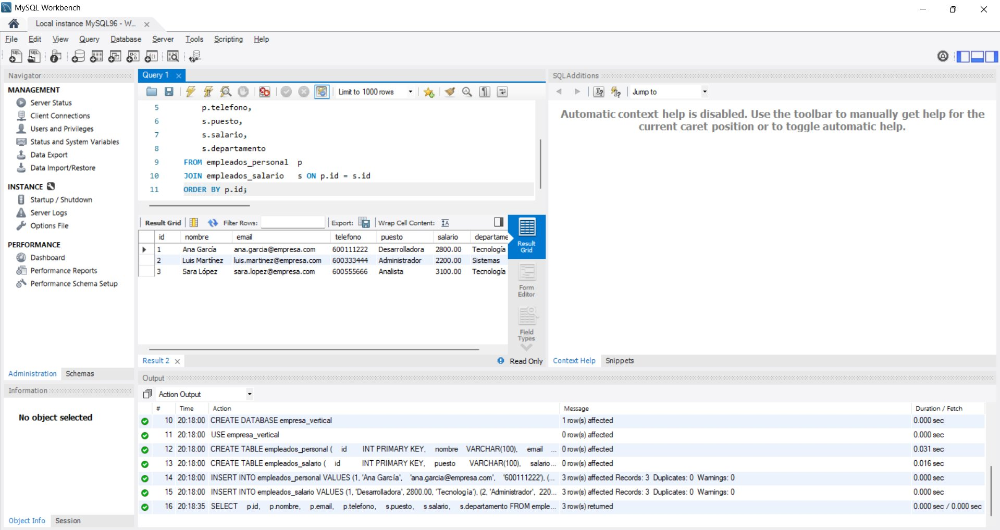

# Tarea 9 — Simulación de base de datos distribuida y fragmentación

**Jhoan Camilo Arango Ortiz** · 2º ASIR online · Administración de Sistemas Gestores de Bases de Datos

---

## Objetivo

Simular una base de datos distribuida usando MySQL, aplicando fragmentación horizontal (dividir filas entre nodos) y fragmentación vertical (dividir columnas entre tablas), y demostrar cómo se reconstruye la información completa mediante consultas SQL.

---

## 1. Fragmentación horizontal — nodo Madrid

Se crea la base de datos `empresa_madrid` con una tabla `empleados` que almacena únicamente los registros correspondientes a la sede de Madrid.

```sql
CREATE DATABASE empresa_madrid;
USE empresa_madrid;

CREATE TABLE empleados (
    id        INT PRIMARY KEY,
    nombre    VARCHAR(100),
    puesto    VARCHAR(100),
    salario   DECIMAL(8,2),
    ciudad    VARCHAR(50)
);

INSERT INTO empleados VALUES
(1, 'Ana García',    'Desarrolladora',  2800.00, 'Madrid'),
(2, 'Luis Martínez', 'Administrador',   2200.00, 'Madrid'),
(3, 'Sara López',    'Analista',        3100.00, 'Madrid');
```



*Creación de empresa_madrid y carga de los tres empleados del nodo Madrid.*

---

## 2. Fragmentación horizontal — nodo Barcelona

Se crea la base de datos `empresa_barcelona` con la misma estructura pero con los registros de la sede de Barcelona, con IDs distintos para que no haya solapamiento.

```sql
CREATE DATABASE empresa_barcelona;
USE empresa_barcelona;

CREATE TABLE empleados (
    id        INT PRIMARY KEY,
    nombre    VARCHAR(100),
    puesto    VARCHAR(100),
    salario   DECIMAL(8,2),
    ciudad    VARCHAR(50)
);

INSERT INTO empleados VALUES
(4, 'Marc Puig',     'Diseñador',       2600.00, 'Barcelona'),
(5, 'Núria Soler',   'Project Manager', 3400.00, 'Barcelona'),
(6, 'Jordi Vidal',   'Soporte',         2100.00, 'Barcelona');
```



*Creación de empresa_barcelona y carga de los tres empleados del nodo Barcelona.*

---

## 3. Reconstrucción horizontal con UNION ALL

Para obtener el listado completo de empleados de toda la empresa, se combinan ambas bases de datos con `UNION ALL`. Al tener IDs disjuntos no hay riesgo de duplicados, y `ORDER BY id` garantiza un resultado ordenado.

```sql
SELECT id, nombre, puesto, salario, ciudad
FROM empresa_madrid.empleados
UNION ALL
SELECT id, nombre, puesto, salario, ciudad
FROM empresa_barcelona.empleados
ORDER BY id;
```



*Resultado de la consulta UNION ALL: los seis empleados de ambos nodos ordenados por ID.*

---

## 4. Fragmentación vertical

En `empresa_vertical` se divide la información de cada empleado entre dos tablas: `empleados_personal` (datos de contacto) y `empleados_salario` (puesto y retribución). Ambas comparten el campo `id` como clave primaria para poder reconstruir el registro completo.

```sql
CREATE DATABASE empresa_vertical;
USE empresa_vertical;

CREATE TABLE empleados_personal (
    id        INT PRIMARY KEY,
    nombre    VARCHAR(100),
    email     VARCHAR(150),
    telefono  VARCHAR(20)
);

CREATE TABLE empleados_salario (
    id           INT PRIMARY KEY,
    puesto       VARCHAR(100),
    salario      DECIMAL(8,2),
    departamento VARCHAR(80)
);

INSERT INTO empleados_personal VALUES
(1, 'Ana García',    'ana.garcia@empresa.com',    '600111222'),
(2, 'Luis Martínez', 'luis.martinez@empresa.com', '600333444'),
(3, 'Sara López',    'sara.lopez@empresa.com',    '600555666');

INSERT INTO empleados_salario VALUES
(1, 'Desarrolladora', 2800.00, 'Tecnología'),
(2, 'Administrador',  2200.00, 'Sistemas'),
(3, 'Analista',       3100.00, 'Tecnología');
```



*Creación de las dos tablas fragmentadas verticalmente y carga de datos coherentes.*

---

## 5. Reconstrucción vertical con JOIN

La operación `JOIN` sobre el campo `id` reconstruye la ficha completa de cada empleado a partir de sus dos fragmentos, devolviendo todos los atributos en una única fila.

```sql
SELECT
    p.id,
    p.nombre,
    p.email,
    p.telefono,
    s.puesto,
    s.salario,
    s.departamento
FROM empleados_personal  p
JOIN empleados_salario   s ON p.id = s.id
ORDER BY p.id;
```



*Resultado del JOIN: ficha completa de cada empleado reconstruida desde las dos tablas.*

---

## 6. Preguntas teóricas

**¿Qué ventajas tiene la fragmentación?**

Distribuir los datos entre nodos mejora el rendimiento porque cada servidor gestiona un subconjunto más pequeño. Las consultas que solo afectan a un nodo no necesitan acceder al resto, lo que reduce la carga de red y el tiempo de respuesta. Si un nodo cae, los datos del resto siguen disponibles, aumentando la disponibilidad global. La fragmentación vertical permite además controlar el acceso a columnas sensibles de forma granular, asignando permisos distintos a cada tabla.

**¿Qué problemas puede generar?**

El principal inconveniente es la complejidad al recuperar datos completos: cualquier consulta que cruce varios nodos requiere operaciones UNION o JOIN entre bases de datos, más costosas que una consulta local. Mantener la coherencia es un reto: si un registro se actualiza en un nodo pero no en otro aparecen inconsistencias difíciles de detectar. La gestión administrativa también se complica, ya que hay que monitorizar varios servidores, coordinar los backups y aplicar cambios de esquema de forma sincronizada en todos los nodos.
