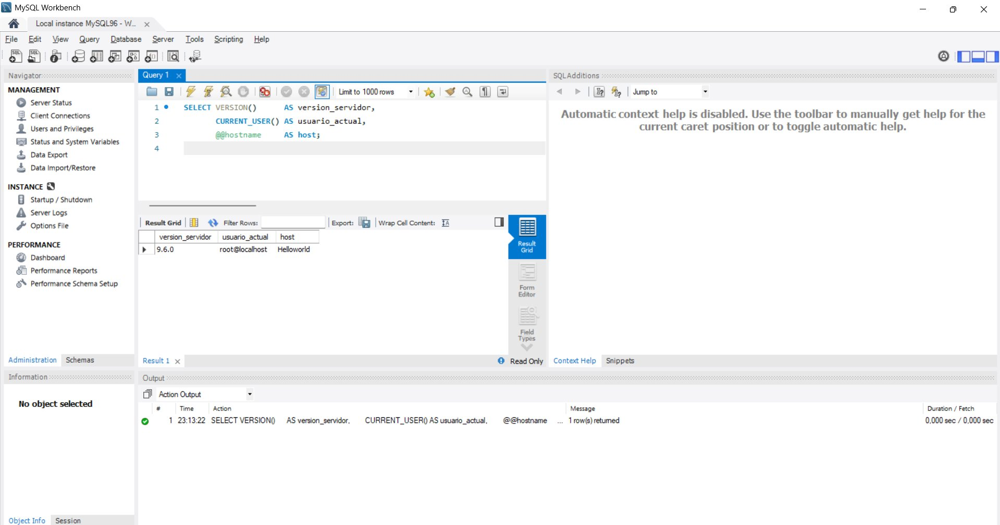
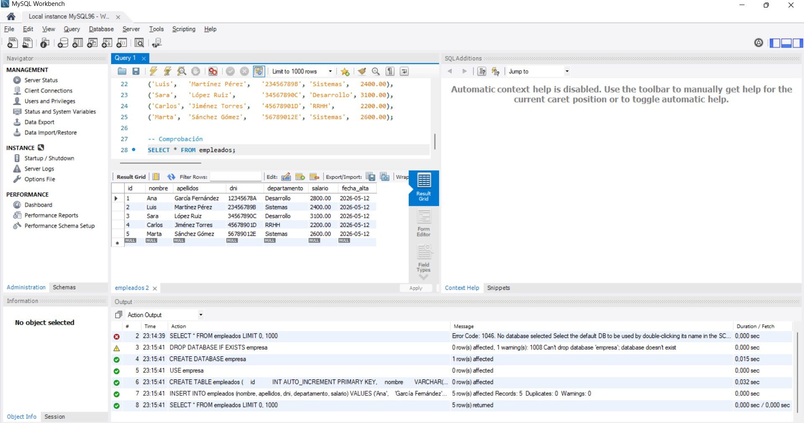
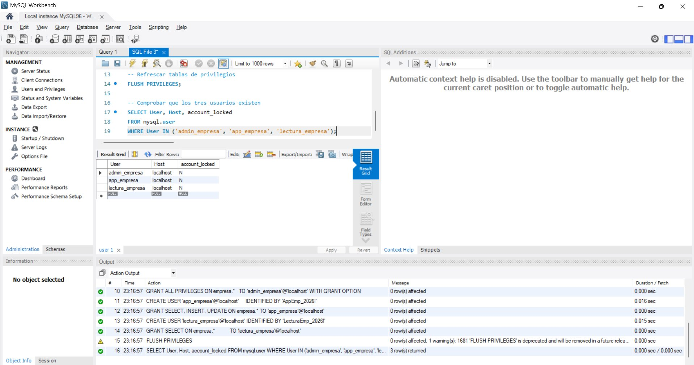
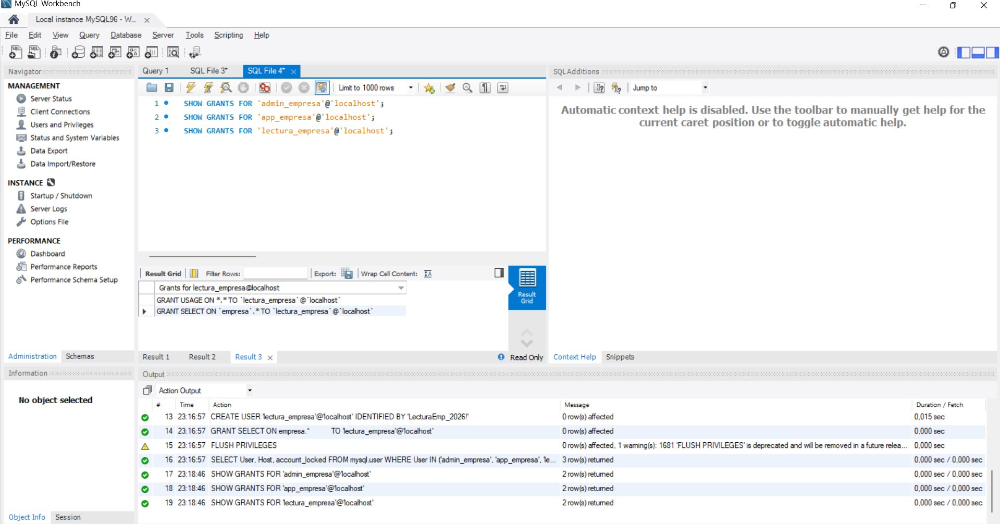
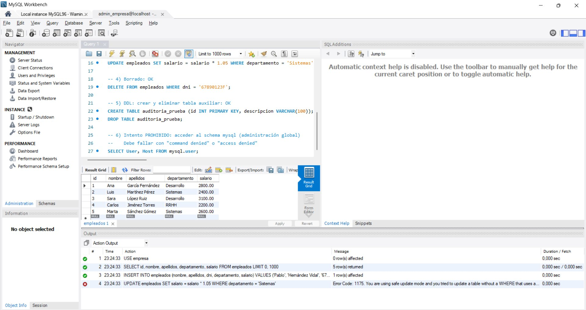
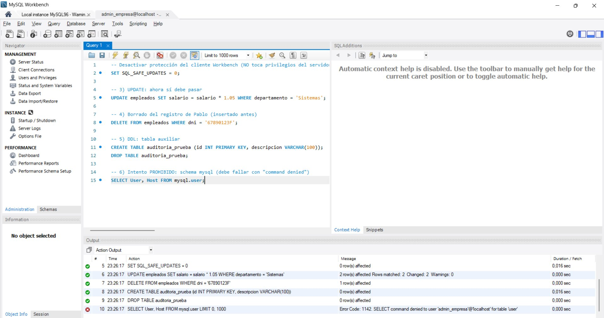
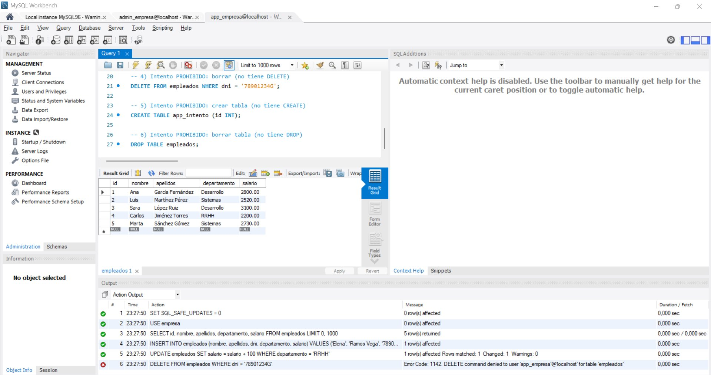
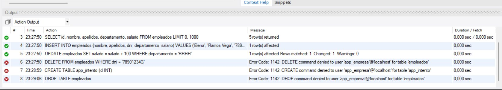
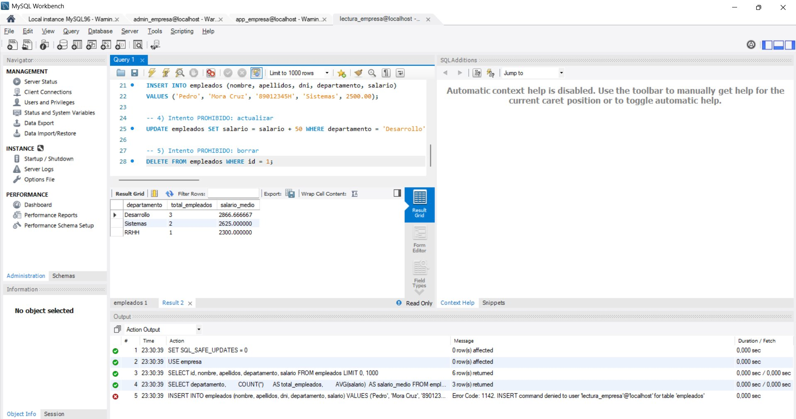
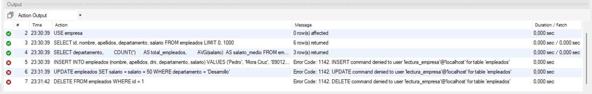

# Tarea 11 — Control de acceso en MySQL

**Módulo:** Gestión de Bases de Datos · 2º ASIR online
**Alumno:** Jhoan Camilo Arango Ortiz
**SGBD:** MySQL 9.6 · **Cliente:** MySQL Workbench

---

## Objetivo

Aplicar el principio de mínimo privilegio sobre una base de datos `empresa`. Se crean tres usuarios distintos de `root`, cada uno con los permisos justos para su rol, y se verifica con pruebas funcionales que cada uno hace lo que debe hacer y rechaza lo demás.

| Usuario | Rol | Privilegios sobre `empresa.*` |
|---|---|---|
| `admin_empresa` | Administrador de la BBDD | `ALL PRIVILEGES WITH GRANT OPTION` |
| `app_empresa` | Aplicación (día a día) | `SELECT, INSERT, UPDATE` |
| `lectura_empresa` | Consulta / informes | `SELECT` |

---

## 1. Preparación del entorno

Comprobación de la versión y el usuario conectado:

```sql
SELECT VERSION()      AS version_servidor,
       CURRENT_USER() AS usuario_actual,
       @@hostname     AS host;
```



*Captura 1. MySQL 9.6.0 sobre root@localhost.*

Creación de la BBDD `empresa`, la tabla `empleados` y carga de cinco registros iniciales:

```sql
DROP DATABASE IF EXISTS empresa;
CREATE DATABASE empresa;
USE empresa;

CREATE TABLE empleados (
    id           INT AUTO_INCREMENT PRIMARY KEY,
    nombre       VARCHAR(50)  NOT NULL,
    apellidos    VARCHAR(100) NOT NULL,
    dni          CHAR(9)      UNIQUE,
    departamento VARCHAR(50),
    salario      DECIMAL(10,2),
    fecha_alta   DATE DEFAULT (CURRENT_DATE)
);

INSERT INTO empleados (nombre, apellidos, dni, departamento, salario) VALUES
('Ana',    'Garcia Fernandez', '12345678A', 'Desarrollo', 2800.00),
('Luis',   'Martinez Perez',   '23456789B', 'Sistemas',   2400.00),
('Sara',   'Lopez Ruiz',       '34567890C', 'Desarrollo', 3100.00),
('Carlos', 'Jimenez Torres',   '45678901D', 'RRHH',       2200.00),
('Marta',  'Sanchez Gomez',    '56789012E', 'Sistemas',   2600.00);
```



*Captura 2. Action Output con las operaciones en verde y los cinco empleados en la grid.*

---

## 2. Creación de los tres usuarios

Todo se hace con sentencias SQL estándar. Las contraseñas cumplen la política de validación por defecto de MySQL 9 (longitud, mayúsculas, números y carácter especial):

```sql
-- 1) Administrador de la BBDD empresa (NO es root)
CREATE USER 'admin_empresa'@'localhost'   IDENTIFIED BY 'AdminEmp_2026!';
GRANT ALL PRIVILEGES ON empresa.*   TO 'admin_empresa'@'localhost' WITH GRANT OPTION;

-- 2) Usuario de aplicación (operaciones del día a día)
CREATE USER 'app_empresa'@'localhost'     IDENTIFIED BY 'AppEmp_2026!';
GRANT SELECT, INSERT, UPDATE ON empresa.* TO 'app_empresa'@'localhost';

-- 3) Usuario de solo lectura
CREATE USER 'lectura_empresa'@'localhost' IDENTIFIED BY 'LecturaEmp_2026!';
GRANT SELECT ON empresa.*           TO 'lectura_empresa'@'localhost';

FLUSH PRIVILEGES;
```

El `WITH GRANT OPTION` del administrador le permite delegar privilegios dentro de `empresa`, pero no fuera: no puede crear usuarios nuevos a nivel global porque no tiene `CREATE USER` sobre `*.*`.



*Captura 3. Los tres usuarios creados con sus permisos y verificación en `mysql.user`.*

---

## 3. Comprobación con SHOW GRANTS

```sql
SHOW GRANTS FOR 'admin_empresa'@'localhost';
SHOW GRANTS FOR 'app_empresa'@'localhost';
SHOW GRANTS FOR 'lectura_empresa'@'localhost';
```

Resultado para cada uno:

- **admin_empresa** → `GRANT ALL PRIVILEGES ON empresa.* ... WITH GRANT OPTION`
- **app_empresa** → `GRANT SELECT, INSERT, UPDATE ON empresa.*`
- **lectura_empresa** → `GRANT SELECT ON empresa.*`

Además, todos arrastran `GRANT USAGE ON *.*` por defecto (significa simplemente "el usuario existe y puede conectarse, sin más privilegios").



*Captura 4. SHOW GRANTS de lectura_empresa. Las tres pestañas inferiores corresponden a los tres usuarios.*

---

## 4. Pruebas funcionales

Tres conexiones nuevas en Workbench, una por usuario. En cada una se ejecutan operaciones permitidas y operaciones prohibidas para verificar empíricamente los privilegios.

> Nota: antes de cada bloque se ejecuta `SET SQL_SAFE_UPDATES = 0` para desactivar la protección del cliente Workbench. Esto NO afecta a privilegios del servidor; solo permite ver los errores reales de permisos sin que Workbench bloquee los UPDATE/DELETE por su cuenta.

### 4.1. admin_empresa

```sql
SET SQL_SAFE_UPDATES = 0;
USE empresa;

SELECT id, nombre, apellidos, departamento, salario FROM empleados;
INSERT INTO empleados (nombre, apellidos, dni, departamento, salario)
VALUES ('Pablo', 'Hernandez Vidal', '67890123F', 'Desarrollo', 2900.00);
UPDATE empleados SET salario = salario * 1.05 WHERE departamento = 'Sistemas';
DELETE FROM empleados WHERE dni = '67890123F';
CREATE TABLE auditoria_prueba (id INT PRIMARY KEY, descripcion VARCHAR(100));
DROP TABLE auditoria_prueba;

-- PROHIBIDO: acceso al schema mysql
SELECT User, Host FROM mysql.user;
```



*Captura 5. Lectura de empleados como admin_empresa.*



*Captura 6. Siete operaciones permitidas sobre `empresa.*` (verde) y la última en rojo con `Error 1142: SELECT command denied to user 'admin_empresa'@'localhost' for table 'user'`. El admin no puede salir de su BBDD.*

### 4.2. app_empresa

```sql
SET SQL_SAFE_UPDATES = 0;
USE empresa;

SELECT id, nombre, apellidos, departamento, salario FROM empleados;
INSERT INTO empleados (nombre, apellidos, dni, departamento, salario)
VALUES ('Elena', 'Ramos Vega', '78901234G', 'Desarrollo', 2700.00);
UPDATE empleados SET salario = salario + 100 WHERE departamento = 'RRHH';

-- PROHIBIDOS
DELETE FROM empleados WHERE dni = '78901234G';
CREATE TABLE app_intento (id INT);
DROP TABLE empleados;
```



*Captura 7. Lectura como app_empresa.*



*Captura 8. Tres operaciones permitidas (SELECT, INSERT, UPDATE) en verde y tres rechazadas en rojo: `DELETE command denied`, `CREATE command denied`, `DROP command denied`.*

### 4.3. lectura_empresa

```sql
SET SQL_SAFE_UPDATES = 0;
USE empresa;

SELECT id, nombre, apellidos, departamento, salario FROM empleados;

SELECT departamento,
       COUNT(*)     AS total_empleados,
       AVG(salario) AS salario_medio
FROM empleados
GROUP BY departamento;

-- PROHIBIDOS
INSERT INTO empleados (nombre, apellidos, dni, departamento, salario)
VALUES ('Pedro', 'Mora Cruz', '89012345H', 'Sistemas', 2500.00);
UPDATE empleados SET salario = salario + 50 WHERE departamento = 'Desarrollo';
DELETE FROM empleados WHERE id = 1;
```



*Captura 9. SELECT agregado por departamento como lectura_empresa. Los informes funcionan con este usuario aunque sea de solo lectura.*



*Captura 10. Tres lecturas en verde y tres intentos de modificación en rojo (INSERT, UPDATE y DELETE rechazados con Error 1142).*

---

## 5. Conclusiones

Tres lecciones del experimento:

1. **MySQL discrimina por operación**. No es todo o nada: un mismo usuario puede leer e insertar pero no borrar, exactamente como necesitaría una aplicación real.
2. **El aislamiento por schema funciona**. Un administrador con `ALL PRIVILEGES` sobre `empresa.*` sigue rebotando contra `mysql.user`, porque sus privilegios están delimitados al schema, no son globales.
3. **El privilegio mínimo no cuesta esfuerzo extra**. Dos sentencias `CREATE USER` + `GRANT` bien pensadas y, a cambio, el día que algo vaya mal (una inyección, una credencial filtrada, un comando ejecutado donde no toca), el daño está acotado.

El paso lógico siguiente en un entorno real es sacar a `root` de la circulación del día a día y reservarlo solo para crear usuarios y cambiar privilegios. Con el `admin_empresa` ya se cubre el 99% del mantenimiento operativo.
